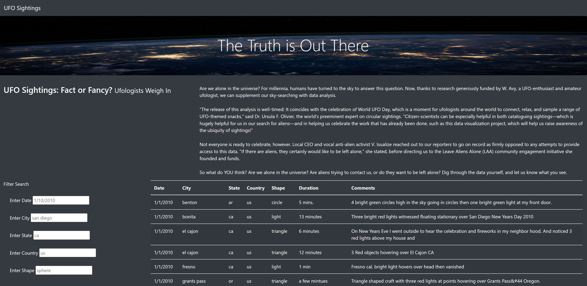
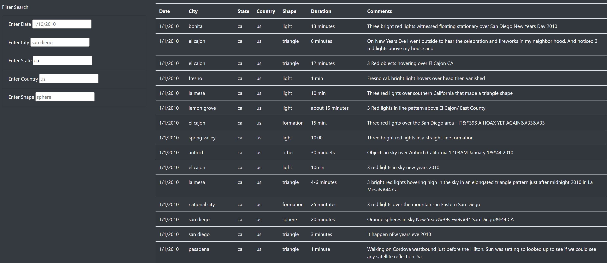

# UFOs

## Overview
The purpose of this project was to create a UFO sightings webpage that 
allows users to filter their searches by multiple criterias. 

## Results
Searches of UFO sightings can be filtered using the filter search found on
the left side of the webpage. Searches can be filtered by date, city, state, 
country, or shape. The example below shows UFO sightings by state. 

## Summary
One drawback of this design is that the information is limited to only UFO
sightings in the US, so filtering the search by country is pointless. The 
formatting of the text can be fixed as well to be more grammatically correct. 
There are errors in the names of the shape section that needs to be corrected.
